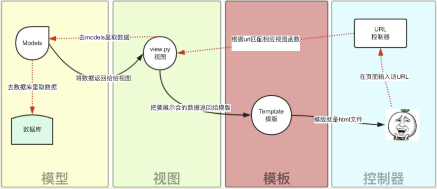
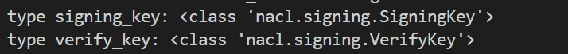
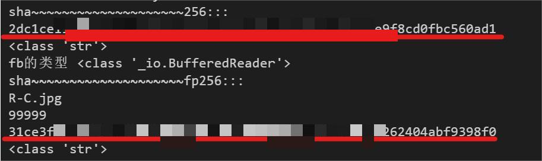
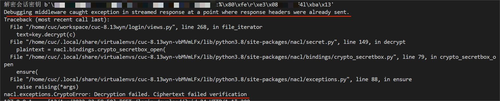
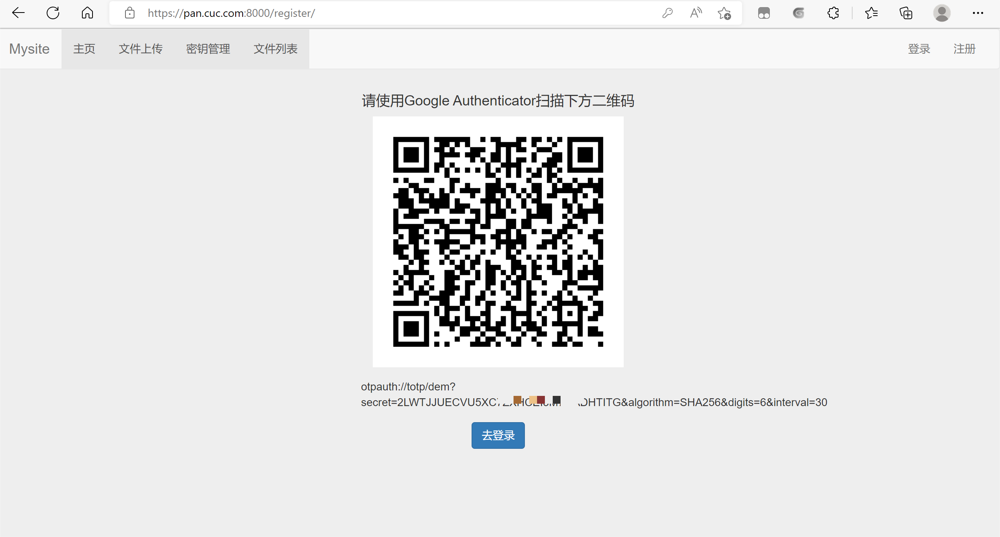
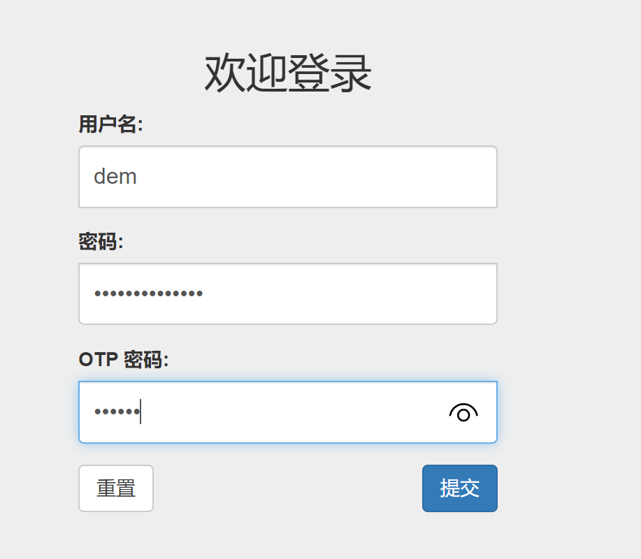

# 中传放心传个人实验报告


## 1 功能完成情况


### 1.1 主要贡献

- 完成基于网页的用户注册与登录系统的基本框架的搭建，项目基于 Django 4.0.6 + Bootstrap 3 + MySQL 8.0  ，并完成环境配置
- 实现基本的用户注册和登录功能
- 利用 pynacl 密码库实现提供匿名用户客户端对下载后的文件进行数字签名并验证 


### 1.2 参与完成

- 参与学习 https 绑定证书到域名而非 IP 地址 
- 参与修改采用 pynacl 库进行文件对称加密上传和解密功能的部分 bug
- 参与研究生成文件下载 URL 并设置有效期的验证思路，采用 token 进行身份验证
- 未完全实现的 OTP 双因素认证


## 2 实验总结

对实验过程及学习到的内容进行汇总，提出印象深刻的 bug 和解决方法。


### 2.1 框架搭建及环境配置


#### 2.1.1 Django

学习了 Django 框架搭建的基本方法，以及 Django 框架的组成和运作模式。

> Django 的 MTV 模式本质上和 MVC 是一样的，也是为了各组件间保持松耦合关系，只是定义上有些许不同，Django 的 MTV 分别是指：
>
> - M 表示模型（Model）：编写程序应有的功能，负责业务对象与数据库的映射(ORM)。
> - T 表示模板 (Template)：负责如何把页面(html)展示给用户。
> - V 表示视图（View）：负责业务逻辑，并在适当时候调用 Model和 Template。
>
> 除了以上三层之外，还需要一个 URL 分发器，它的作用是将一个个 URL 的页面请求分发给不同的 View 处理，View 再调用相应的 Model 和 Template。
>
> 

一个项目的最最基本架构大概是这样：

```
$ tree
.
|-- app
|   |-- __init__.py
|   |-- settings.py           # 项目启动配置文件
|   |-- urls.py               # url 配置
|   |-- views.py              # 添加的视图函数文件         
|   |-- wsgi.py
`-- manage.py
```

通过上图很好的理解了 `Django` 的工作模式，其中 `settings.py` 包含了 `Django`项目启动的所有配置项，是实现项目数据库初始模板设置、域名配置、项目中应用的注册等，在实际使用过程中，`views.py`  的作用可以视为前端和后端的交接枢纽，可以用 `request` 让后端获得前端数据，也可通过对 `models.py` 中建立的模型链接到数据库，从数据库中查询数据并实现调用。 `url.py` 实现的是前端页面的路由，页面需要在这个文件中配置，实现和对应视图函数的关联，即将 `views.py` 于Templates 模板关联起来。所以在初期架构系统时，其他脚本文件的添加及运用主要是围绕这几个文件的配置来实现。


#### 2.1.2 Mysql 8.0

在配置 Mysql 时， Django  需要将项目中创建的数据表结构映射到数据库中，需要创建权限用户 `root`，可以登录到 mysql 服务器。但是在开始配置时，由于不知道管理员用户的初始密码而无法正常在 MySQL 中创建数据表。因此需要对 Mysql root 用户数据库权限进行设置，在查询多种资料后，解决方法如下。

```mysql
# 查看mysql数据库自动设置的随机账户与密码
$ sudo cat /etc/mysql/debian.cnf  

# 获得<user> 和 <password> 字段，使用这两个字段的值登录
$ mysql -u <user> -p
Enter password: <password>

# 配置root,置空 authentication_string 字段
# authentication_string:表示用户密码
mysql> update user set authentication_string='' where user='root'; 

# 为root设置密码
mysql> alter user 'root'@'localhost' identified with mysql_native_password by '123456（自行设置）';

#设置成功，退出
mysql> quit;

#重启
$ service mysql restart
```

在解决重置 Mysql 用户的过程中，在**配置 root** 这一步，网上出现很多干扰信息，大部分出现用以下两条命令来解决，

```mysql
mysql>update user set password=PASSWORD("password") where user=root; 
```

```mysql
mysql> update user set authentication_string=PASSWORD("password") where user=‘root’; 
```

但其实这两条命令仅适用于 Mysql 5.7 版本及以下的用户，Mysql 5.7.9 以后废弃了 password 字段和 password() 函数，所以不适用于 Mysql 8.0 版本解决问题。

另外，在 Django 项目中对 `models.py  ` 表结构做出的修改，需要对数据表的修改进行映射和迁移

```python
$ python manage.py makemigrations  # 映射

$ python manage.py migrate  # 迁移
```


### 3 用户注册和登录

在实现用户的注册和登录功能这里除了前后端的传参的实现外，通过导入 forms 模块创建注册和登录表单，

> - 对于非POST方法发送数据时，比如GET方法请求页面，返回空的表单，让用户可以填入数据；
> - 对于POST方法，接收表单数据，并验证；
> - 使用表单类自带的`is_valid()`方法一步完成数据验证工作；
> - 验证成功后可以从表单对象的`cleaned_data`数据字典中获取表单的具体值；
> - 如果验证不通过，则返回一个包含先前数据的表单给前端页面，方便用户修改。也就是说，它会帮你保留先前填写的数据内容，而不是返回一个空表！
>
> 另外，Python内置了一个locals()函数，它返回当前所有的本地变量字典，我们可以将这作为render函数的数据字典参数值，就不用费劲去构造一个形如`{'message':message, 'login_form':login_form}`的字典了。这样做的好处当然是大大方便了我们，但是同时也可能往模板传入了一些多余的变量数据，造成数据冗余降低效率。

- `is_valid()` ：作用是检查表单对象是否都正确，例如长度，空值，类型等。

  ```python
  if register_form.is_valid():    # 运用
  ```

- `cleaned_data` ：返回表单对应类型的返回值

- `locals()` : 返回当前所有的本地变量字典

  ```python
  return render(request, 'login/login.html', locals())   # 返回提示信息到登录页面
  ```

  

### 4 数字签名认证


#### 4.1 数字签名原理

考虑到文件较大，系统采用私钥对对称加密后文件的散列值进行签名，并进行存储。在匿名用户对文件进行下载时，利用输入的公钥对数字签名进行解密验证，实现系统身份的认证。再与计算加密文件得到的散列值进行对比，相等则可验证文件的完整性，继而对文件解密。

公私钥对的生成和加密解密算法的实现均使用 pynacl 密码库，具体使用参考 [PyNacl 官方文档](https://pynacl.readthedocs.io/en/latest/)。


#### 4.2 值得注意的问题

值得注意的是密钥和文件在存储和调用的**类型转换**。

在利用函数生成公钥私钥时，会生成有对应类型的数据。

```python
signing_key = SigningKey.generate()   # 私钥  <class 'nacl.signing.SigningKey'>

verify_key = signing_key.verify_key	  # 公钥  <class 'nacl.signing.VerifyKey'>
```



而 Django 的 Form 表单属性的数据类型 Field 中没有可以直接存储对应存储类型，根据官方文档，利用 `key.encode(encoder=HexEncoder)` 将密钥类型转换为 bytes类型。

```python
signing_key_bytes = signing_key.encode(encoder=HexEncoder)  # 私钥 64 bytes
verify_key_bytes = verify_key.encode(encoder=HexEncoder)    # 公钥 64 bytes
```

Form 表单属性的数据类型 Field 中同样没有可以直接存储 bytes 类型的数据，如果直接存储，提取出来的密钥也会变为 str 类型，且长度会发生改变，导致密钥不可用，所以需要数据类型转换为 string 。

如果采用 str() 函数以及 UTF_8 编码，会出现报错：

```bash
'utf-8' codec can't decode byte 0xa8 in position 7: invalid start byte。
```

意思是 UTF_8 无法对 `0xa8` 进行编码，根据查询资料，发现如果是英文数据，可以采用 ISO-8859-1 进行编码，运行后编码成功。

```python
signing_key_str = str(signing_key_bytes,encoding='ISO-8859-1')   #bytes转换为string
# 公钥同理
```

注意，公钥和私钥在从数据库中调用时，需要 pynacl 库中的内置函数进行类型转换，转换成相应的公钥和私钥类型才可正常进行运算。

```python
# 引用官方文档

# 私钥
# For example you can generate a signing key and encode it in hex with:
hex_key = nacl.signing.SigningKey.generate().encode(encoder=nacl.encoding.HexEncoder)

# Then you can later decode it from hex:
signing_key = nacl.signing.SigningKey(hex_key, encoder=nacl.encoding.HexEncoder)

#公钥
# Create a VerifyKey object from a hex serialized public key
verify_key = VerifyKey(verify_key_bytes)
```

当然解决这个问题也有其他方法。数字签名中发现，即使密钥正常，依然无法正确解密文件，在数字签名中体现为：用公钥解密的得到的散列值与直接计算得到的散列值不同。



根据输出读取的内容 fb 类型 可以看出，可能是存储或者提取的时候存在类型转换的问题。

考虑到密钥存储以及老师提供的建议，发现在加密过程中，文件采取分块加密，由于之前在对文件加密时存在两行报错：



解决时利用 `pickle.dump` 对文件进行封装，即是一个将Python数据对象转化为字节流的过程序列化存储。而在解密中则是直接读取，未进行拆装这一逆操作。

```python
# 加密存储
with open('./static/files/'+file.name,mode='wb') as f:    
	for chunk in file.chunks():
		c = key.encrypt(chunk)
		content += c
	pickle.dump(content, f) # 序列化存储
```

解密操作更改后为：

```python
# 调取对应加密文件
filepath = os.path.join('./static/files/', str(filename))
content = b''  
with open(filepath,'rb') as f:
    c = pickle.load(f)  # 反序列化
    content += c
```

总结下来，对于数据存储关于数据类型的解决方法一个是改变编码，还有是可以利用序列化和反序列化的方法解决。


### 5 OTP 双因素认证（实现Authenticator）

OTP双因素认证根据学习，主要使用 `pyotp ` 、`qrcode` 和 `urlencode` 这几个库，

在用户注册时，利用 pyotp 库的内置函数生成种子密钥，再利用 `pyotp.TOTP()`  函数，其内部具有时间戳，可以通过种子密钥随时间改变生成不同的密钥，

```python
otp_secret_key = pyotp.random_base32()
totp = pyotp.TOTP(otp_secret_key)    # TOTP必须大写
# 返还给code.html页面
#生成二维码并存储 
img = qrcode.make(qr_url).save('./static/code/code.png')
```

可以生成密钥后，我们需要利用密钥，设置哈希生成函数，设置密钥 OTP 更新时间间隔，设置 OTP 密钥长度等参数，利用`pyotp.totp.TOTP(otp_secret_key,digits,digest,interval).provisioning_uri(username)` ，生成相应链接，供生成用户可以扫描的二维码。

```python
# 获取二维码 URI
qr_url = pyotp.totp.TOTP(otp_secret_key,digits=6,digest=hashlib.sha256,interval=30).provisioning_uri(username)
qr_url = qr_url + "&" + urlencode({
    "digits": 6,
    "interval": 30
    })
```

生成二维码并存储，这里的存储写的很简陋，属于调试阶段。

```python
#生成二维码并存储 
img = qrcode.make(qr_url).save('./static/code/code.png')
```

注意，需要存储初始种子密钥，在用户登录时进行验证

```python 
# 存储code值 
new_user.otp_secret_key = otp_secret_key
```

用户注册点击提交后，便可跳转到出现二维码图片的页面：



在用户登录时，可根据手机上的 OTP 口令在限制时间内输入进行登录验证。



但是由于学习偏差，一直使用 Authenticator APP 进行检验，可以成功，但是 Google Authenticator APP 上可以实现扫码生成口令，但是不能成功认证登录，经了解发现Google Auth 需要相应的接口才可实现，所以该功能未展示于项目中，供以后学习记录。


#### 参考资料

- [Django用户登录与注册系统参考资料](https://blog.csdn.net/laikaikai/article/details/80563387)
- [文件上传前后端流程](https://blog.csdn.net/qq_36852780/article/details/106798675)
- [Django修改默认端口号](https://blog.csdn.net/lkballip/article/details/109205373)
- [解决端口号占用问题](https://blog.csdn.net/u010168781/article/details/107564524)
- [docker修改mysql映射端口](https://blog.csdn.net/londa/article/details/120196596)
- [Python Django令牌：下载具有令牌身份验证的服务器文件](https://duoduokou.com/python/50803037722557234471.html)
-  [PyNacl 官方文档](https://pynacl.readthedocs.io/en/latest/)

- [双因子验证(Two-factor authentication, 2FA)（HOTP，TOTP）](https://www.cnblogs.com/ljwTiey/p/11505473.html)

- [使用OTP动态口令（每分钟变一次）进行登录认证 ](https://www.cnblogs.com/loveyou/p/6989064.html)
- [Django google-authenticator Google令牌](https://cloud.tencent.com/developer/article/1744887)

 
