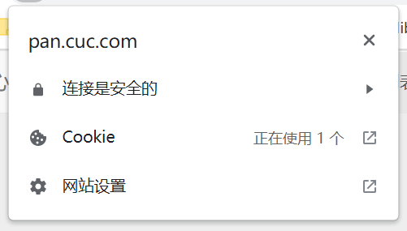
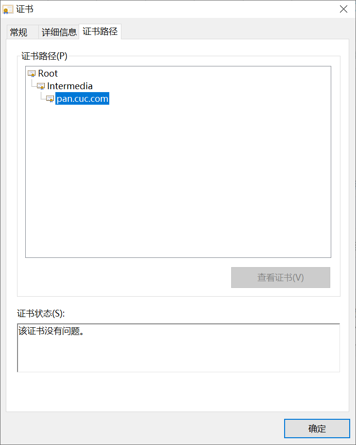
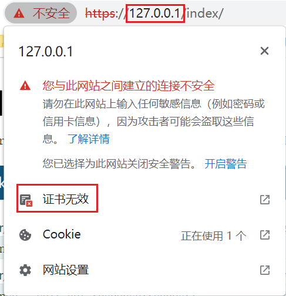
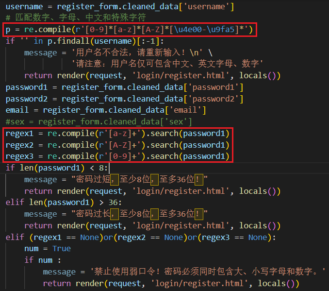
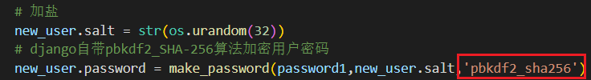
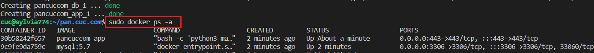
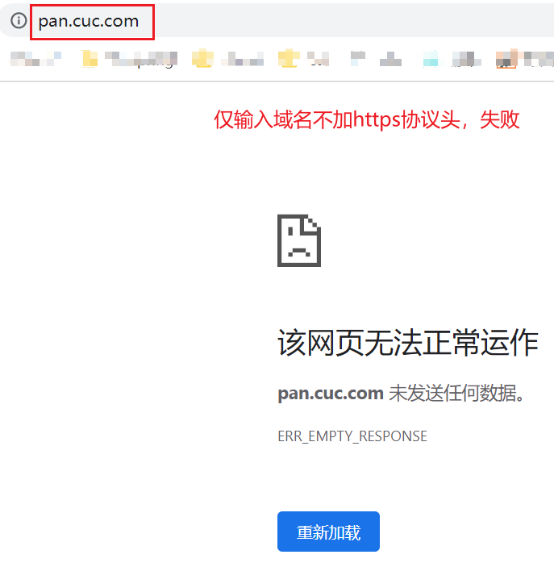
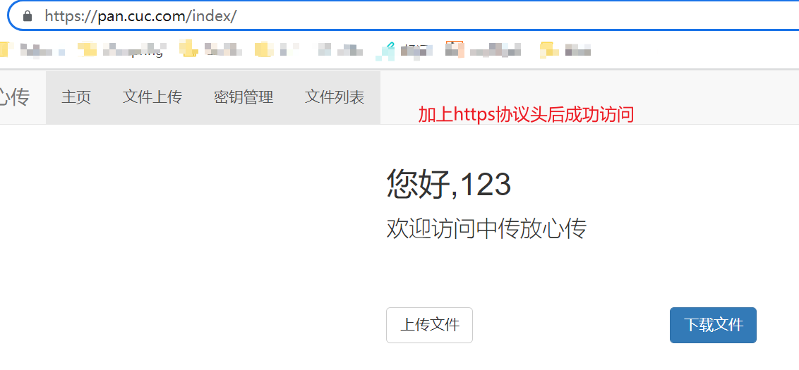
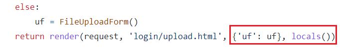
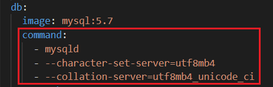

# 「密码学应用实践」总结技术报告

## 主要贡献

- 搜寻汇总往届资料，共同选定项目参考与技术框架，分析实现安全上传下载功能所需的技术与要求。
- 主要完成**基于网页的用户注册与登录系统**的部分板块，实现证书自签发，HTTPS功能，用户注册合法用户名、口令的校验与限制，PBKDF2算法密文存储用户口令等功能。
- 项目后期整体情况检查优化，包括检查项目整体细节逻辑，个性化系统默认配置，优化部分前端显示内容，项目整体django+mysql双容器部署等。

## 完成工作

- **使用openssl自签发三级证书链，实现网站HTTPS安全连接**

  

  

  绑定域名，使用IP访问显示不安全连接

  

  - 关键技术

    - 首先生成顶级CA证书，可以直接私钥，证书一键生成

    - 生成中级证书步骤比根证书多，首先需要生成中级私钥，根据私钥文件，为应用中级证书生成 `csr` 文件（证书请求文件），最后使用顶级CA的公私钥文件给 `csr` 文件签名，生成中级证书

    - 生成应用证书流程与生成中级证书一致，但是最后需要用中级CA的公私钥文件给 `csr` 文件签名，生成终端证书。
    - 安装Django框架实现HTTPS所需依赖项，将依赖项添加进`settings.py`中`INSTALLED_APPS`列表，`python manage.py runserver_plus --cert xx.crt --key xx.key`实现HTTPS访问
    - 将自签发的CA根证书，中级证书安装到需要使用HTTPS访问的客户端中

  - 注意事项

    - 中级证书是具有继续颁发下级证书权限的子CA，而应用证书特指不能用来继续颁发下级证书，只能用来证明个体身份的证书。

      颁发中级证书需要多一个 `-extensions v3_ca` 选项，赋予被签发的证书继续签发下级证书的权力。

    - 注意在颁发应用证书时添加域名绑定信息，否则服务器无法确认本机身份，无法建立安全连接

- **正则表达式校验用户注册信息**

  

  - 关键技术
    - 使用 `compile` 函数将正则表达式的字符串形式编译为一个 Pattern 对象
    - 通过 Pattern 对象提供的一系列方法对文本进行匹配查找，例如是否含有数字，大、小写字母，特殊字符等，返回匹配结果（一个 Match 对象或列表）
    - 最后使用 Match 对象提供的属性和方法获得信息，通过if语句判断，限制用户注册时使用合法范围外的字符。

- **实现用户口令加密存储**

  

  - 关键技术（此技术比较简单）
    - 使用比单纯`Hash+salt`更加安全的`pbkdf2`算法
    - 未使用外来库，而是采用Django自带`make_password`函数，对用户传入明文口令进行加密后存储进数据库

- **实现项目django+mysql双容器部署**

  

  - 关键技术（看起来步骤很少的样子，实际上😅）
    - 在项目根目录新建文件 `Dockerfile`，将当前目录复制到容器的工作目录
    - 新建`requirements.txt`，写入所需环境依赖
    - 新建`docker-compose.yml`，编写`django`+`mysql`容器与启动脚本
    - 安装启动容器所需`docker-compose`
    - 输入指令`sudo docker-compose up -d`启动容器服务
    - 打开浏览器，输入网站名 [https://pan.cuc.com](https://pan.cuc.com)

## BUG 记录

- **HTTPS和URL概念的区别**

  刚开始跟着老师示范视频运行python样例代码的时，因为浏览器会自动省略协议，于是就发生了正确域名输入却无法运行成功的情况发生。（当时没截屏，此处以本次项目为例）

  

  

  `http/https`，仅仅是一字之差就跑不通了，BUG永远发生在这样不起眼的地方。。就是这样的细节也会导致运行的失败。即使学习了很多计算机网络的知识，还是得靠实践才能出真知👍

- **自签发三级证书因为各种原因失败。。**

  - 开发证书看似是一个很简单的事情，创建一个根证书，依次向下签发就行了，但是中间遇到了很多错，做了很长的时间，比如说。一开始不理解，为什么要有中间证书的存在？确实现在网页大多都是三级结构，但是自己动手时就犯懒了，三级结构很标准，两级就不能够用了吗？也没有什么问题啊，结果果然就被浏览器判定为不安全。

    后来看了很多讲解，确实不能将安全问题当做儿戏随便糊弄，分级管理会大大提升根证书的安全。

  - 安装好了中间证书之后，进行应用证书配置时，一般教程都没有绑定到域名，导致通过域名访问时浏览器无法识别访问者的身份，证书不可用，需要在配置文件里额外增加DNS解析。

  - 其实证书总的来说配置并不复杂，但非常繁琐，因为是链条结构，所以有一个错了基本上就要全部推翻，重新层层签发，花了很长时间。

- **登录页面跳转异常**

  刚开始初始化登录页面时，总是用户名，密码，邮箱，验证码都填写，正确页面也没有报错，但总无法跳转到登录成功后的主页界面。

  查看`view.py`里与登录相关`def login()`,定位表单返回语句发现问题

  

  教程中首先返回了一次提交表单，又再次使用了locals函数

  locals() 函数本身作用就是以字典类型返回当前位置的全部局部变量，相当于提交了两次表单变量但系统也无法识别报错导致无法跳转成功。删去前面 `{'uf': uf}`后登录成功。

  所以有的时候的教程啊。。。。有点用也有点坑。

- **docker容器中mysql set utf8mb4 的默认启动配置**

  docker生成mysql容器，默认字符集为`Latin`，不兼容中文字符，导致每次数据迁移时均会报错，但如果仅是手动更改容器中数据库的字符集设置，每次重启后系统又将恢复到初始设置，每次手动设置又违背了方便交付的初衷，不知道怎么才能够通过命令行完成默认启动配置的更改。

  一开始方向错误想在`Dockerfile`中拉取mysql环境，方便设置，但是文档已经拉取了python环境，再次拉取mysql就会报错。后来才想到在`docker-compose.yml`中进行修改，添加`command`命令，修改系统默认字符设定

  

## 总结

这一个月很长，但在暑假里看来又不是很长，每天都有别的事情，但总会抽一点时间来琢磨一下这个实践项目下一步应该怎么做。

组内工作分配的很平均，每个人其实要做的工作量都差不多。这次主要做了一些基础前期工作，跟密码学实践非常相关的加密，解密工作没能更多参与，有一点点遗憾，但是有空会好好补起来的，项目是靠大家的共同努力才圆满完成的，这才有更大的意义。

从一开始觉得在痴人说梦，到现在真真切切的看着页面弹出来，感觉非常不一般。抓耳挠腮的很多个白天和夜晚，厚着脸皮怕被骂删了又输的聊天框，总是开着时有人进时有人出的会议室。家里，图书馆，路上，每一个敲打电脑的角落，只能说这一个月我过得很充实，也很满意。

写一写别的，记得实践里有一天，当时很晚了还请了黄伟老师进小组会议里给我们讲解要求里关于密码学的应用分析（其实很不好意思。。），大家都听得很认真，每个人都有不同板块的问题要问，老师也耐心的讲了很久。下了会议之后很感动，上大学总感觉是单打独斗，这种成为一个团队，为了同一个目标而共同奋斗的样子已经很久没有过了，就算是线上大家也想办法聚在一起学习。很开心，遇见了很棒的组员们❤

## 参考资料

- [理解HTTPS及配置Django+HTTPS开发环境](https://zhuanlan.zhihu.com/p/79943327)
- [Linux 使用openssl x509方式签发证书](https://blog.csdn.net/QianLiStudent/article/details/109818208)
- [使用OpenSSL工具制作X.509证书的方法及其注意事项总结](https://blog.csdn.net/howeverpf/article/details/21622545#t2)
- [Django-Docker容器化部署](https://www.dusaiphoto.com/article/73/)
- [docker-compose 启动utf-8 mysql](https://blog.csdn.net/y515789/article/details/116604052)