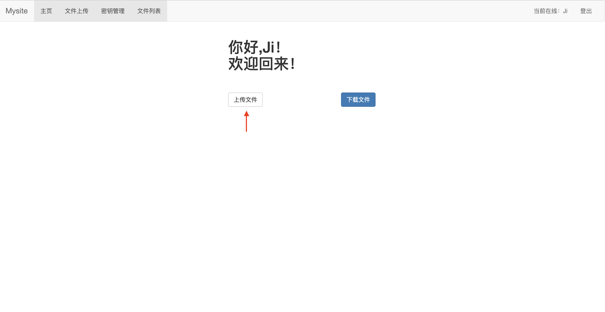
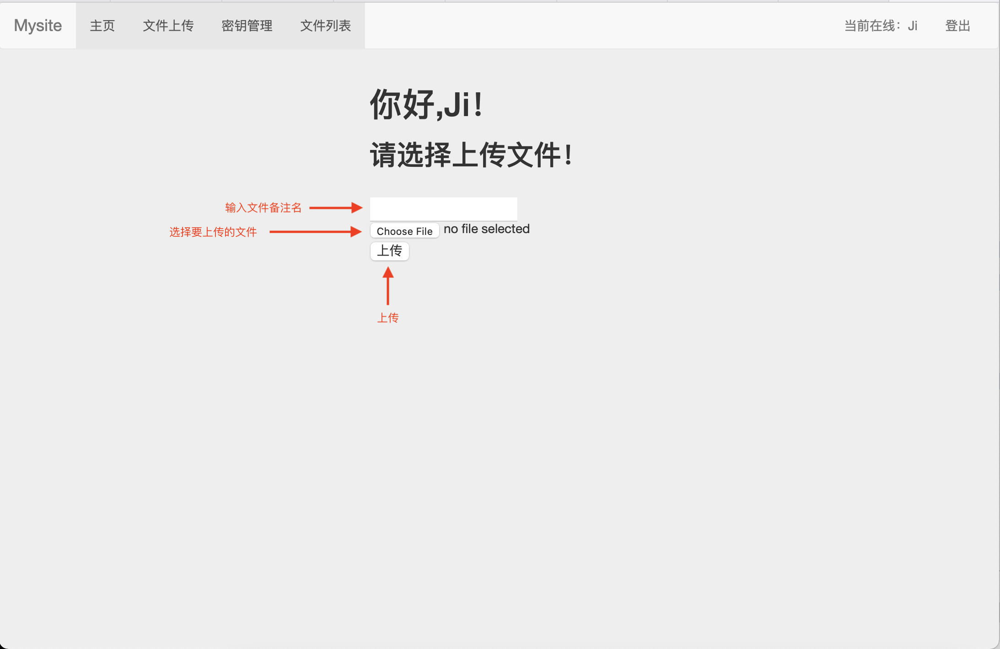
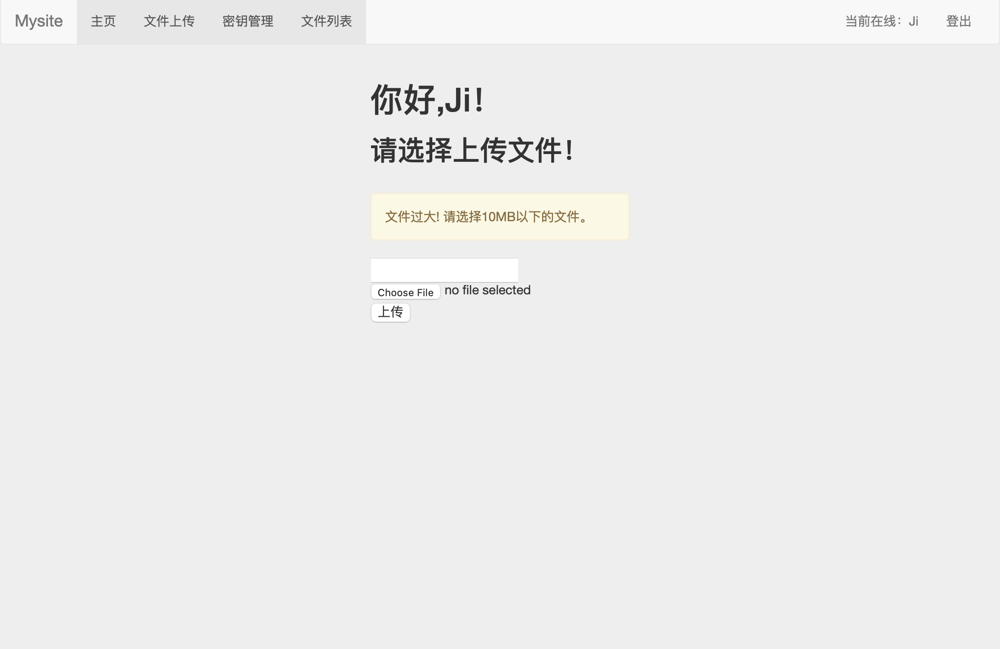
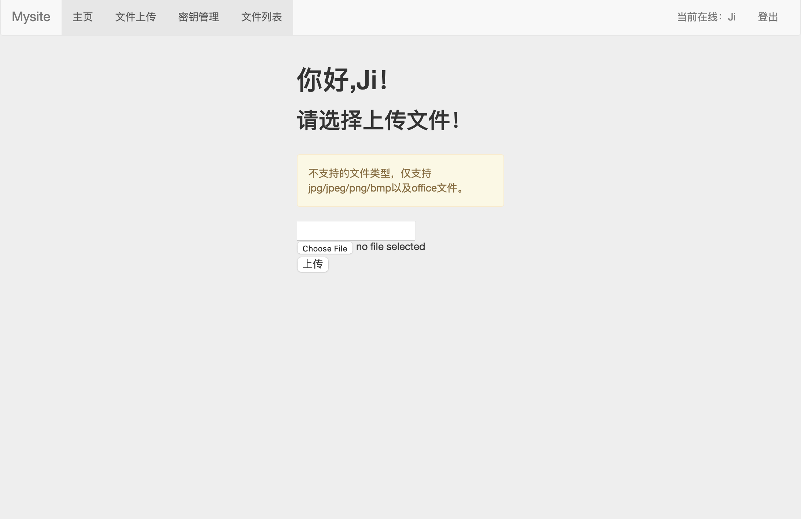
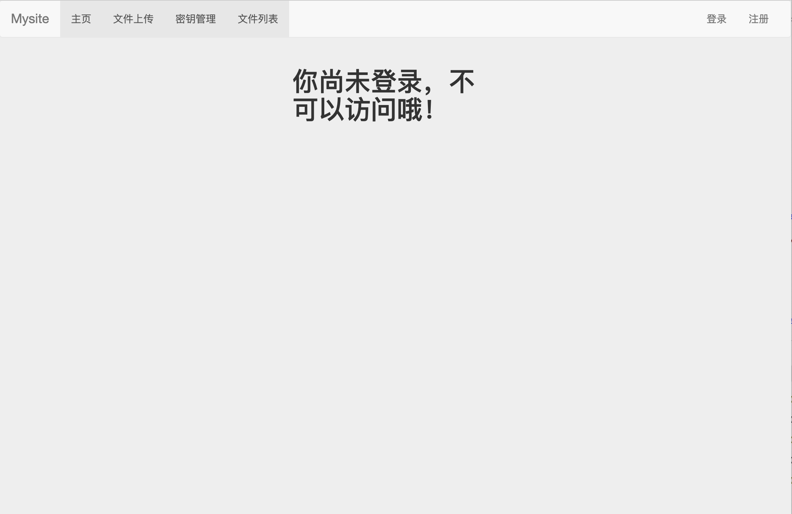
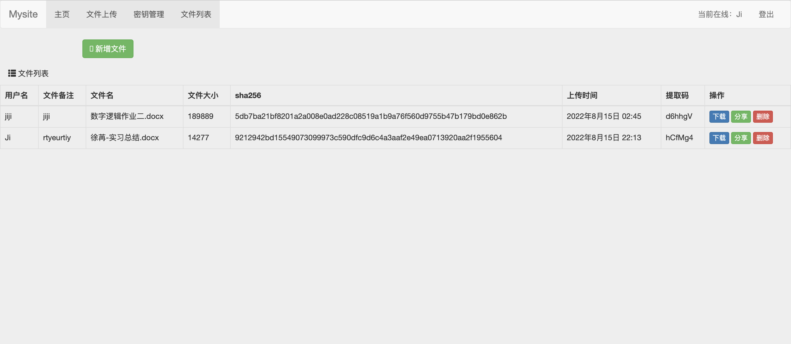
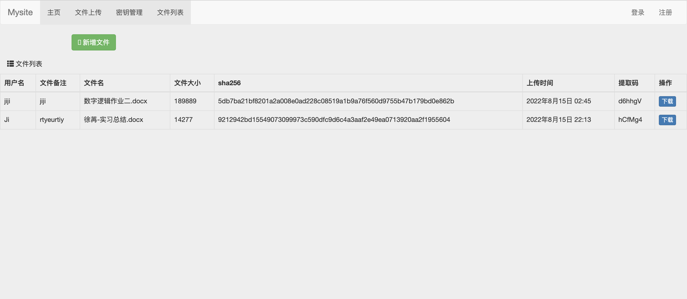

# 技术报告
---
[一个基于python+django实现的文件管理系统](https://github.com/Ning-Lorraine/F4-CUC-PracticalCryptography)
<br>

**作者：** 

**负责工作：** 注册用户和匿名用户的文件加密与解密实现

---
## 负责部分
---
我负责的部分是：
- 基于网页的文件上传加密与数字签名系统（20分）
  - [x] 已完成《基于网页的用户注册与登录系统》所有要求
  - [x] 限制文件大小：小于 10MB
  - [x] 限制文件类型：office文档、常见图片类型
  - [x] 匿名用户禁止上传文件
  - [x] 对文件进行对称加密存储到文件系统，禁止明文存储文件 【 对称加密 密钥管理（如何安全存储对称加密密钥） 对称加密密文的PADDING问题 】
差异） 】
- 基于网页的加密文件下载与解密（20分）
  - [x] 已完成《基于网页的文件上传加密与数字签名系统》所有要求
  - [x] 提供匿名用户加密后文件和关联的数字签名文件的下载
    - 客户端对下载后的文件进行数字签名验证 【 非对称（公钥）加密 数字签名 】
    - 客户端对下载后的文件可以解密还原到原始文件 【 对称解密 密钥管理 】
  - [x] 提供已登录用户解密后文件下载
---
## 前言
---

“中传放心传”是一个：
* 基于网页的用户注册与登录系统
* 基于网页的文件上传加密与数字签名系统
* 基于网页的加密文件下载与解密的系统
  
在一个月的实验过程中，我们小组通力合作，从零开始开发，基本实现了作业清单里的每一点要求。通过最后不断的优化和调试，最终呈现出这样的作业效果。虽然最终呈现的成品仍有不足，但是过程大于结果。

从最初看到作业要求的迷茫，到一步步确认是基于半成品开发还是选择从零开始写一个属于我们自己的网站，再到在编程语言之间的徘徊与纠结以及到底要不要用框架、用哪个框架，最终再一次又一次激烈的讨论中，我们确定了这样一个基于`python+django`的文件管理系统。


考虑到自己密码学学的比较薄弱，很多知识都知识停留在理论而没有实践，于是在这一个月的小学期实践中我能分配到加密解密部分是组员对我的信任，也是我自我提升的一个过程。在实验的过程，其实遇到了很多困难，很多时候都觉得自己无法突破甚至想要放弃，但是通过小组组员一起的讨论和调试以及网上资料的查找、视频的学习，最终的困难都能迎刃而解。这一个月的小学期实践虽然漫长且艰难，但是也弥补了许多我在平时学习中的不足，也收获了许多密码学、网页搭建相关的知识，我觉得收获的过程才是小学期最终的意义。

---
## 开发过程回顾
---
在这次网站的开发中我主要负责的部分是文件的上传以及文件上传时的加密以及下载时的解密，在这次开发过程遇到了很多困难，印象尤为深刻的有一下几点：

### 初期困难模式：🌟🌟🌟

### 主要问题：Django操作不熟练

* 遇到的问题1:首先，在写文件上传的页面时，一直不懂如何在点击“上传”时获取本地的文件资源管理器的弹窗，因为这个时候是刚开始着手写这个网站，一切都还不是很熟悉，对于django这个框架也知之甚少，工作的推进尤为缓慢。因为前端页面无法创建导致后端的函数不知道如何定义
  * 解决办法：在网上搜寻各种资料无果后，我决定先缓和两天，去b站上搜索了`python+django`相关的教程，大致梳理了django这个框架的结构和作用（[参考教程](https://www.bilibili.com/video/BV1uA411b77M?spm_id_from=333.999.0.0&vd_source=1cdb5e20bad2af25921f327621feabee)），在学习中大致了解了django中HTML表单的交互作用，学习了`GET`和`POST`是如何从前端相应并将获取的数据传入后端的，从而写出了文件上传的部分。
  
    上传文件页面前端展示：
    
    ```html
    
    
    上传文件
    
        <link rel="stylesheet" href="">
    
    {
        <div class="container">
            <div class="col-md-4 col-md-offset-4">
                    
                        <h1>你好,{{ request.session.user_name }}！<br></h1>
                        <h2>请选择上传文件！</h2>
                        <br>
                        <form method="post" action="" enctype="multipart/form-data">
                            
                                <div class="alert alert-warning">{{ message }}</div>  
                            
                            {{uf}}
                            
                            <input type="text" name="username">
                            <input type="file" name="avatar">
                            <input type="text" name="user" hidden value="{{request.session.user_name}}"/>
                            <input type="submit" value="上传"/>
                        </form>
                    
                        <h1>你尚未登录，不可以访问哦！</h1>
                    
            </div>
        </div> <!-- /container -->
    
    ```
    点击上传，跳转到下面这个页面：
    
    在这里上传了超过10MB大小的文件，显示错误提示
    
    在这里上传了不符合允许上传类型的文件，显示错误提示
    
    在这里我们登出系统，成为非注册用户，跳转到了一个不可访问的界面
    
  
* 遇到的问题2:在实现了文件的上传之后尝试写一个展示上传文件的文件列表，因为考虑到下载时非注册用户需要知道上传者的姓名从而获取对方的公钥验证数字签名。但是出现的问题是用户注册时文件列表可以显示用户名，但是登出之后，文件列表的用户名都为空，并且如果换一个新的用户登录的话，文件列表显示的用户名都是当前注册者的用户名，这显示是不合理的。
  * 解决办法：出现当前的问题的原因是，我在前端显示用户名时使用的是`{request.session.user_name}`，再去研究`{request.session}`的作用，我理解的这里是直接从前端获取当前登录的用户名，却无法读取后端存入数据库之中的用户数据。虽然这是一个非常细小的问题，但是造成的后果是牵一发而动全身的，所以必须要迅速解决。仔细思索后大致思路是：能够在上传文件的时候在前端获取此时此刻上传该文件的用户，然后写入数据库，前端展示时只需要迭代执行数据库查询即可。

    具体修改如下：在前端的upload.html里面写入，这样在上传文件时就能获得此时传入文件的用户名
    ```html
    <input type="text" name="user" hidden value="{{request.session.user_name}}"/>
    ```
    在后端upload函数中，修改数据库的创建`user_name=request.POST.get('user')`，把此时的用户名存入数据库之中
    ```python
    file = models.File.objects.create(
                    custom_filename=form.cleaned_data['username'],
                    user_name=request.POST.get('user'),
                    filename=file_object.name,
                    size=file_object.size,
                    sha256 = file_sha256,
                    keynumber = str(createRandomString(6))
                ) 
    ```
    在list函数中读取File数据库的集合
    ```python
    ueryset=models.File.objects.all()
    return render(request,'login/list.html',{'queryset':queryset})
    ```
    在前端中迭代读取集合中需要展示出来的数据
    ```html
    
      <tr>
          <td>{{obj.user_name}}</td>
      </tr>
    
    ```
    最终呈现出来的效果达到预期：
    注册用户查看列表：
    
    非注册用户查看列表：
    

### 中期困难模式：🌟🌟🌟🌟（主要涉及到后面解密产生的一大串问题）

### 主要问题：PyNacl库不了解

* 遇到的问题1:文件加密不知道该使用什么样的密码学库，后来通过老师的建议去学习了PyNavl这个密码学库的相关知识，大致了解了如何生成会话密钥以及用户的公钥私钥。在这里还没有太大的问题，只要照着[PyNacl文档](https://pynacl.readthedocs.io/en/latest/public/)一步一步仿写即可（此时还没有解密，并不知道未来会遇到什么样可怕的，难以突破的问题😨），但是现在的问题就是密钥该如何存储。
  * 解决办法:
    ```python
      key = nacl.utils.random(nacl.secret.SecretBox.KEY_SIZE)
      box = nacl.secret.SecretBox(key)
    ```
    * 参考PyNacl文档，在最初我们直接存储了生成的会话密钥key，但是仔细阅读文档后得知，这是不安全的操作，因为一旦获取了key就会生成box，然后就能轻易解密
    * 如何加密存储密钥这是一个重要的问题，因为会话密钥是不能被轻易得到的，所以最终经过认真的考虑决定存储根据key生成的box。

### 后期困难模式：🌟🌟🌟🌟🌟

### 主要问题：加密和解密的密钥存储在获取时产生的一系列类型转换

* 遇到的问题1:首先，注册用户解密文件，因为是会话密钥，所以需要从数据库中获取之前存储的密钥进行机密，解密主要是`plaintext=key.decrypt(signed_text)`，按照逻辑，将生成的会话密钥存入数据库，然后再从数据库提取该密钥对文件进行解密。但是真正操作时，出现错误提示：类似于'str'没有'decrypt'这一操作，于是考虑是不是需要获取到'bytes'类型的数据，所以对字符串类型进行转化，但是依旧显示没有'decrypt'这一操作。在这里真的挠破了头，怎么都找不到解决问题的办法，和小组组员讨论了很久，把前面的key的类型在存储时进行编码的转化，在解密时又进行类型的转化，但是依旧无法实现文件的解密。尝试了一天一夜，甚至觉得可能真的无法解密了，试图放弃这一步。
  * 解决办法：又在网上搜了一些资料，有一个回答是，在存储密钥时可以将encoding的编码从‘urf-8'改成'ISO-8859-1'，发现在打印生成的密钥和从数据库提取的密钥时可以获取一样长度一样类型的数据了！这是突破性的一步，但是解密时还是出现了报错`Decryption failed. Ciphertext failed verification`依旧不行。最终考虑到是python的加密与解密的转码问题，我们去向安靖老师做了一些咨询，安靖老师建议是可以去查找一些`序列化以及逆序列化`相关的文章看一下，在仔细看了一些文章之后，我尝试在文件加密是，现将加密的文件序列化存储，然后再用逆序列化提取加密后的文件，再用密钥解密，具体修改如下：

    加密过程
    ```python
    with open('./static/files/'+file.name,mode='wb') as f:    
          for chunk in file.chunks():
              content+= chunk
              c = key.encrypt(chunk)
          pickle.dump(c, f)
    ```
    解密过程
    ```python
    with open(filename,'rb') as f:
          while True:
              c=pickle.load(f)
              text=key.decrypt(c)
              if c:
                  yield text
              else:
                  break
      f.close()
    ```
    最终居然成功了！获取到了与上传时一样的明文！因为太突然不敢相信，还以为自己存储了明文进去，但是仔细查看自己存储密文的路径，发现是一串乱码。最终问题解决。


---
## 实验总结
---
以上就是我完成这一部分时印象尤为深刻的几个部分，都花费了很长的时间进行思考和实现，其实还有很多很多奇奇怪怪的bug，可以说这一个月的小学期实践是困难重重，但是还好通过一次次又一次的小组会议，大家的在会议上激烈的讨论和修改，最终实现了这一个并不是非常美观，也可能还有很多技术漏洞的文件管理网站，但是于我们而言已经非常珍贵，因为这个学习的过程和学到的知识才是小学期实践赋予我的真正意义。

最后感谢小组其他三位组员的协助和探讨，帮助我一次又一次理清思路，突破重重困难。


