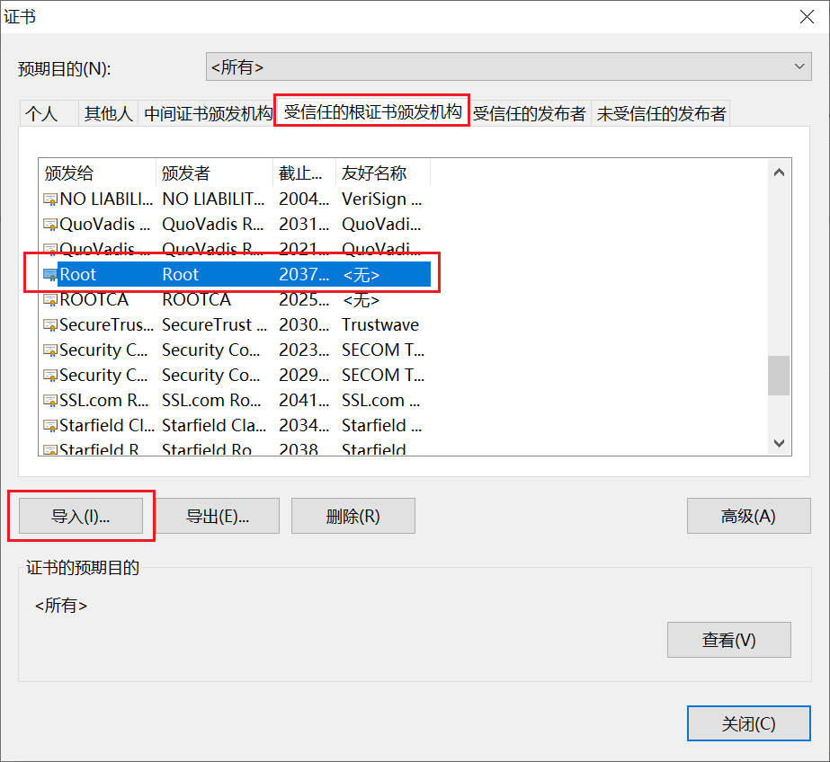
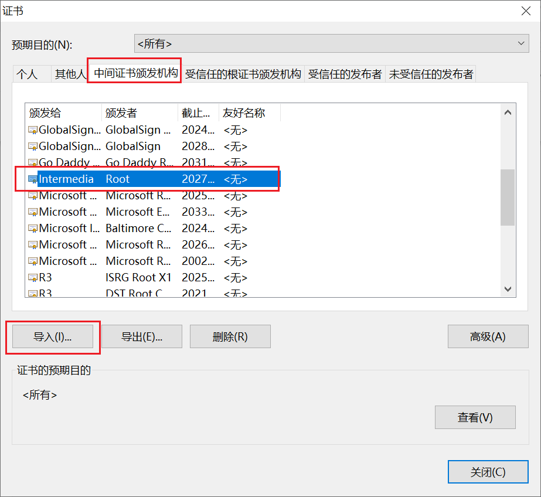

# 中传放心传

本项目是 [中国传媒大学密码学应用实践课程](https://c4pr1c3.github.io/cuc-wiki/ac.html) 的一个作业项目。

## 实现功能清单

- 基于网页的用户注册与登录系统（60分）
  - [x] 使用https绑定证书到域名而非IP地址 【 *PKI* *X.509* 】
  - [x] 允许用户注册到系统
    - 用户名的合法字符集范围：中文、英文字母、数字
      - 类似：-、_、.等合法字符集范围之外的字符不允许使用
    - 用户口令长度限制在36个字符之内
    - 对用户输入的口令进行强度校验，禁止使用弱口令
  - [x] 使用合法用户名和口令登录系统
  - [x] 禁止使用明文存储用户口令 【 PBKDF2 散列算法 慢速散列 针对散列算法（如MD5、SHA1等）的攻击方法】
    - 存储的口令即使被公开，也无法还原/解码出原始明文口令
   
- 基于网页的文件上传加密与数字签名系统（20分）
  - [x] 已完成《基于网页的用户注册与登录系统》所有要求
  - [x] 限制文件大小：小于 10MB
  - [x] 限制文件类型：office文档、常见图片类型
  - [x] 匿名用户禁止上传文件
  - [x] 对文件进行对称加密存储到文件系统，禁止明文存储文件 【 对称加密 密钥管理（如何安全存储对称加密密钥） 对称加密密文的PADDING问题 】
  - [x] 系统对加密后文件进行数字签名 【 数字签名（多种签名工作模式差异） 】

- 基于网页的加密文件下载与解密（20分）
  - [x] 已完成《基于网页的文件上传加密与数字签名系统》所有要求
  - [x] 提供匿名用户加密后文件和关联的数字签名文件的下载
    - 客户端对下载后的文件进行数字签名验证 【 非对称（公钥）加密 数字签名 】
    - 客户端对下载后的文件可以解密还原到原始文件 【 对称解密 密钥管理 】
  - [x] 提供已登录用户解密后文件下载
  - [x] 下载URL设置有效期（限制时间或限制下载次数），过期后禁止访问 【 数字签名 消息认证码 Hash Extension Length Attack Hash算法与HMAC算法的区别与联系 】
  - [x] 提供静态文件的散列值下载，供下载文件完成后本地校验文件完整性 【 散列算法 】

## 本项目用到的关键技术

- 开发语言为Python3.8.10

- 后端基于Django 4.0.6框架

- 前端基于Bootstrap3 框架

  附上[Bootstrap3下载链接](https://v3.bootcss.com/getting-started/#download)和[jQuery下载链接](https://www.jq22.com/jquery-info122)

- 使用MySQL 8.0数据库

## 密码学理论与技术示范应用要点说明
| 密码学理论   | 技术应用 |   技术示范 |作用|
| :------------- | :----------: | :----------: | :----------: | 
|盐值加密 | pbkdf2 | 用户口令加密 |增加密码安全性|
|  对称密钥|   nacl.secret   |  加密文件 | 存储加密文件防止明文被获取 |
| 非对称密钥  |    nacl.signing   | 数字签名|匿名用户验证分享链接用户身份|
|哈希摘要|hashlib|生成文件哈希值|验证下载的明文是否经过篡改|
|哈希摘要|md5|生成token消息摘要|实现散列值校验|
|证书|x.509|配置https|识别网页身份，保护数据传输安全|

## 快速上手体验

- 下载环境依赖并运行

  ```bash
  pipenv install
  pipenv shell
  ```

- 安装数据库

  ```bash
  sudo apt update
  sudo apt install mysql-server
  ```

- 对Mysql root用户数据库权限进行设置

  ```bash
  #查看mysql数据库自动设置的随机账户与密码
  sudo cat /etc/mysql/debian.cnf  
  #获得<user> 和 <password> 字段 ，使用这两个字段登录
  mysql  -u <user> -p
  Enter password: <password>
  
  #配置root
  update user set authentication_string='' where user='root'; 
  #为root设置密码
  alter user 'root'@'localhost' identified with mysql_native_password by '123456（自行设置）';
  
  #设置成功，退出
  quit;
  
  #重启
  service mysql restart
  
  #新建数据库django
  mysql>create database django DEFAULT CHARACTER SET utf8;
  ```

- 运行

  ```bash
  python manage.py runserver_plus
  
  python manage.py runserver_plus pan.cuc.com:8000 --cert app.crt --key-file app.key
  ```


## 附录

- 手动将CARoot.crt，intermedia.crt证书添加至浏览器受信任的根证书，中间证书颁发机构列表，否则浏览器将视其为不安全连接

  

  
  
- [仓库链接](https://github.com/Ning-Lorraine/F4-CUC-PracticalCryptography)

- [视频链接](https://www.bilibili.com/video/BV1LB4y1L72s?spm_id_from=333.999.0.0&vd_source=b6b417005a6423397884b3002dba82fc) 
